# Design and Architecture of _Chirp!_

## Domain model

In our domain model, we capture entities and relationships to provide a high-level abstraction of the system's static structure, thereby centering the focus on the business logic of our Chirp!-system. We provide a complete diagram below:

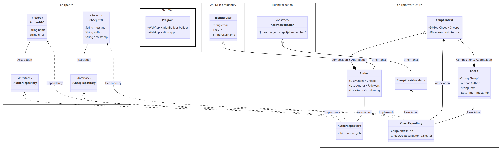

At the highest level in this diagram, we have Chirp.Core, Chirp.Infrastructre, Chirp&#46;Web, wherein certain classes are contained. Apart from this, we have references to external libraries such as AspNetCoreIdentity and FluentValidation.

### Brief Description of Classes inside Chirp.Core

Chirp.Core contains all the core functionality. In Chirp.Core, we have Data Transfer Objects (DTOs) for Cheeps and Authors, as well as interfaces for Author and Cheep Repositories. There is an associative relationship between the DTOs and the repositories, since the repositories use the DTOs to create cheeps and authors, get cheeps and name of authors, follow authors etc. The interface repositories provide an interface contract for the repository implementation that will transfer structured data between different layers of the application and use DTOs as a standardized communication contract in this regard.

### Brief Description of Classes inside Chirp.Infrastructure

Key elements within Chirp.Infrastructure include CheepRepository and AuthorRepository, which are concrete implementations of the Repository interfaces. These repositories use ChirpContext to interact with the database, managing data for authors and cheeps. Each repository handles specific queries related to either authors or cheeps, working with Author and Cheep models. However, they return only Data Transfer Objects (DTOs) to maintain separation of concerns. The Author and Cheep models, stored in the database, are queried from the dbsets of the dbcontext. The composition relationship between the Author and Cheep classes and ChirpContext ensures data integrity, as removing the context also removes the associated data models from the program.

The Author class inherits from Identity User to streamline authentication and authorization for a Chirp author. There is a composite relationship between Author and Cheep, indicating that an Author can own 0 or more cheeps and that any existing cheep is owned by a unique Author.

### Brief Description of Classes inside Chirp&#46;Web

Inside of Chirp&#46;Web, we have our Program.cs, which is the class the program is run from. It has the fields WebApplicationBuilder builder and WebApplication app, which are used for encapsulating the app's services and middleware and for building the web application, setting up authentication and services necessary to make the application run.

## Architecture — In the small

The diagram above depicts the Onion-architecture of our code-base. The different layers and their position shows which code they have access to. 'Chirp.Core' only know about itself, whereas 'Chirp.Infrastucture' has access to the code in 'Chirp.Core' but not the outer layers - except for the database as depicted with the arrow in the diagram. In general, upper layers should depend on lower layers. The Onion Architecture organizes our software in a manner, where we can keep our main business rules separate from external details. This separation of concerns makes the software easier to understand and change. It is also good for testing and adapting to new requirements and technologies. It adheres to SOLID-principles like Dependency Inversion.

## Architecture of deployed application

We will briefly discuss the architecture of the deployed application, which is based on a client-server-model.

In the illustration below, the Web Server, hosted on Azure, manages user requests and serves the website, while the SQL Server, also on Azure, stores structured data like user information and chirps. The Client browser communicates with the Web Server, which contains the webpage artifact. The Web server, in turn, interacts with the SQL Server, which contains the SQL_Database artifact, for database operations. In this manner, the Client does not directly connect to the SQL Server; but instead communicates with the Web Server, which handles the interaction with the database.

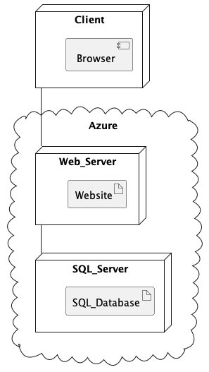

## User activities

We will outline a few different user journeys to showcase the capabilities of Chirp! users. This includes showcasing possible actions for an unauthorized user, guiding through registration and login processes, and demonstrating a typical user journey within the Chirp! app when logged in.

### Un-authorised User Journey

For an unauthorized user, typical actions might involve viewing cheeps on the public timeline or accessing specific details about an author, such as past cheeps, total cheeps, and other information, which would be accessible through the author's private timeline. A user journey corresponding to this use of Chirp is described in the following User Activity diagram:

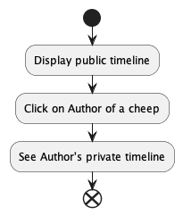

### Registration and Login processes {#login-register}

For the full Chirp! experience, authorized users can personalize their interaction by posting, liking cheeps, and following authors. The registration and log-in processes are described in the following diagrams:

#### Registration

To register, users click the "Register" button and choose either GitHub, where they will be authorized if they have an account on Github, or they can enter their username, email and password, and then click "Register." After registration, users are redirected to the public timeline, where they can start following other users, liking their posts, and also posting cheeps.

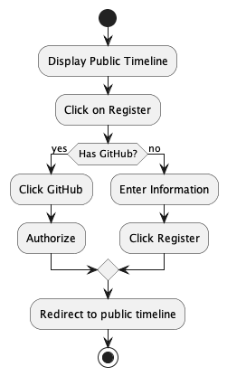

#### Log-in

To log in, users click the login button, choose either GitHub or enter their username and password. Upon successful login, users are redirected to their private timeline if they are following someone or to the public timeline if they are not following anyone yet.

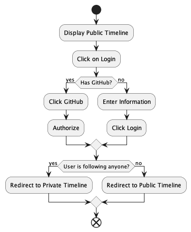

### Cheeping and Following Authors

When using Chirp, users primarily write cheeps or follow authors and like their cheeps. The upcoming descriptions will illustrate user journeys centered around these actions. In both of the chapters below, we assume the user have already been through the [log-in or registration process](#login-register) to engage in these functionalities.

#### Following

The user starts by visiting the Public timeline. They click on author x to view that author's timeline. If they are not already following this author, they hit "follow," go to their private timeline, and check what author x has posted. If they already follow this author, the user unfollows the author, then checks their private timeline to ensure author x's cheeps are no longer visible.

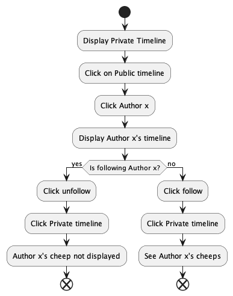

#### Cheeping

We assume, we have a user, who is already following other users. When this is the case, a user sees their private timeline, when logged in, where they see their own posts and posts from the people they follow. They then share short cheeps (up to 160 characters) and then look at their private timeline again to see what they've posted.

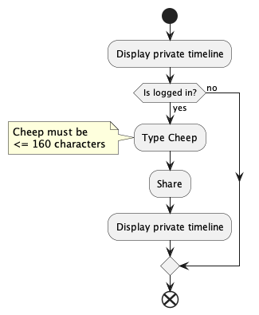

## Sequence of functionality/calls through _Chirp!_

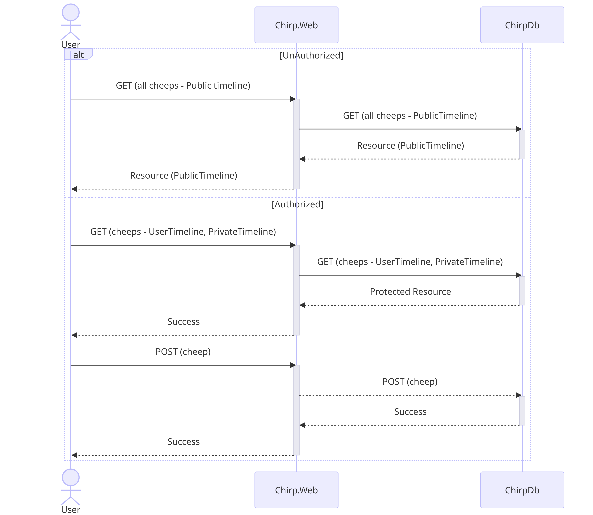

With this sequence diagram we show an overview of the simple sequences both an unauthorized and authorized user will go through to access different parts of the our application.

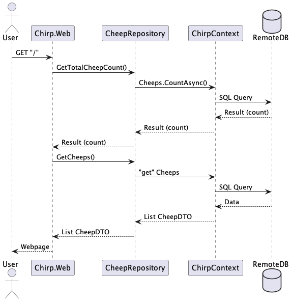

We see the sequence of calls that is made both internally by the program and externally, from a unauthorized user, sending a simple GET request to the root endpoint (acessing bdsagroup9chirprazor.azurewebsites.net).

# Process

This chapter gives a brief overview of our process, showcasing GitHub Actions workflows with UML activity diagrams. We highlight our team's project board's status and offer clear instructions for local setup and testing.

## Build, test, release, and deployment

We use Github Workflows to streamline and automate software development processes and ensure continuous integration and continuous delivery.

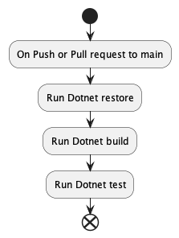

The illustration above shows our build and test workflow, which ensures that the code passes all tests before merging a pull request to main.

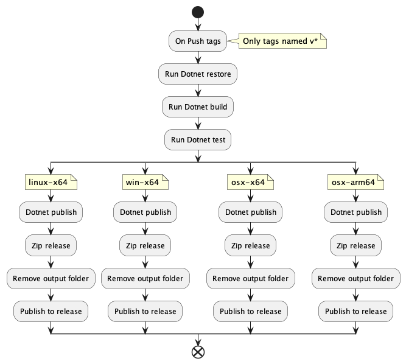

In the illustration above, we see the workflow that creates a release of the program to Github. It is triggered when a tag of the format v\* is pushed to github.

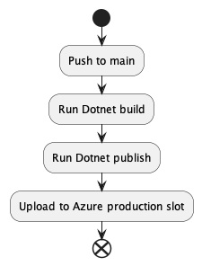

This Github workflow is triggered after a push to main, and releases main to our production environment.

## Team work

In this chapter, we will provide an overview of our collaboration by discussing the status of tasks on our project board and showing the general flow of activities from task creation to integration of features.

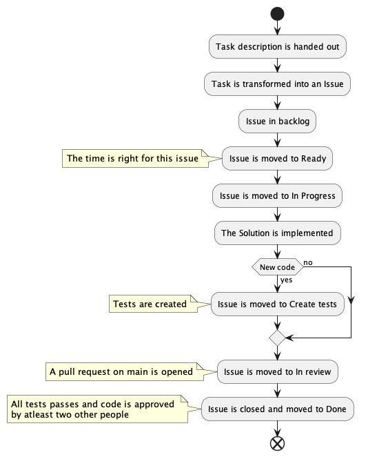

We set up a KanBan board to handle our issues and give us an overview of the process an issue had to go through.

-   The issue is created and put into the 'Backlog'.
-   When the issue is ready with a description, acceptance criteria and has no dependencies pending it is moved to then coloumn 'Ready'.
-   When we start working on the issues it is moved to the 'In progress' coloumn.
-   If the issue relates to the code-base and we have determined it is done, it is moved to 'Create tests'.
-   When tests have been made (if necessary) a PR is created and the issues is moved to the coloumn 'In review'.
-   If the PR for the issues gets approved, it is merged into the main-branch. If this is the case the issue can be closed and moved to the 'Done' coloumn.

## How to make _Chirp!_ work locally

Firstly, open a command prompt. From here, navigate to the folder in which you want the project to be, and run the command:

`git clone https://github.com/ITU-BDSA23-GROUP9/Chirp.git`

Then, navigate to the Chirp folder with the command:

`cd Chirp`

Navigate to src/Chirp.Web by running the command:

`cd src/Chirp.Web/`

Then start the application by running the command:

`dotnet run`

## How to run test suite locally

Firstly, open a command prompt. Navigate to the folder in which the Chirp! application is. When standing in the root folder, to run all tests, simply run the command:

`dotnet test`

If you want to run tests for individidual parts of the system, first go to the test directory with the command:

`cd test`

Then go into an individual directory, for example by running:

`cd Chirp.Core.Tests/`

Then run the command:

`dotnet test`

# Ethics

In this chapter, we'll discuss the software license we've chosen and explain how we've utilized AI/Large Language Models in our development process.

## License

We have chosen the MIT License for our application. Mainly due its simplicity, which makes it easy for students to collaborate and simplifies licensing issues. In addition, it allows for lots of people to use our webpage, and if we potentialy wanted to commercialize Chirp!, the license is really flexible and allows this.

## LLMs, ChatGPT, CoPilot, and others

In this report we have only made use of the LLM's: ChatGPT and CoPilot.

**ChatGPT**: has been used to understand the theory behind some of the features which we have implemented, and generally not to generate code, unless explictly specified as co-writer. In some cases, it has been used for debugging purposes, indicated by including it as a co-writer in commit messages.

**CoPilot**: was only used in the later stages of the process to speed up code-writing-proces when writing generic code. (We decided in the beginning that we would follow Rasmus' reccomendation of writing code without CoPilot, when we were learning the basics of C#.)

### Usefulness and efficiency of LLMs

Language models (LLMs) helped us understand concepts and find bugs efficiently. However, directly using them to generate code for more complex architecture might lead to more debugging, which was why we only used it for generating very generic code. It's important to use LLMs in a way where you benefit from their strengths without slowing down the development process.
