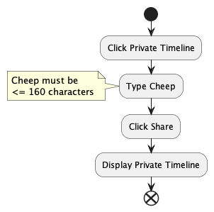

# Design and Architecture of _Chirp!_

## Domain model

Here comes a description of our domain model.

## Architecture — In the small

Mangler deployment diagram - næste skridt

## Architecture of deployed application

We will briefly discuss the architecture of the deployed application, which is based on a client-server-model.

In the illustration below, the Web Server, hosted on Azure, manages user requests and serves the website, while the SQL Server, also on Azure, stores structured data like user information and chirps. The Client browser communicates with the Web Server (with the webpage artifact), which, in turn, interacts with the SQL Server, which contains the SQL_Database artifact, for database operations. In this manner, the Client doesn't directly connect to the SQL Server; but instead communicates with the Web Server, which handles the interaction with the database.

## User activities

We will outline a few different user journeys to showcase the capabilities of Chirp! users. This includes showcasing actions for an unauthorized user, guiding through registration and login processes, and demonstrating a typical user journey within the Chirp! app when logged in.

#### Un-authorised user-journey

For an unauthorized user, typical actions might involve viewing cheeps on the public timeline or accessing specific details about an author, such as past cheeps, total cheeps, and other information, which would be accessible through the author's private timeline. This process is depicted in a simple User Activity diagram, where the unauthorized user navigates the webpage to view public cheeps and then explores a specific author's timeline on Chirp! for more details.

#### Registration and Login processes: {#login-register}

For the full Chirp! experience, authorized users can personalize their interaction by posting, liking cheeps, and following authors. Let's illustrate the registration and log-in processes to demonstrate how users can achieve this.

##### Registration:

To register, users click the "Register" button and choose either GitHub, where they will be authorized if they have an account in Github, or they can enter their password, username, and email, and then click "Register." After registration, users are redirected to the public timeline, where they can start following other users, liking their posts, and also posting cheeps.

##### Log-in:

To log in, users click the login button, choose either GitHub or enter their password and username. Upon successful login, users are redirected to their private timeline if following someone or to the public timeline if not following anyone yet.

#### Cheeping and Following Authors

When using Chirp, users primarily write cheeps or follow authors and like their cheeps. The upcoming descriptions will illustrate user journeys centered around these actions. In both of the chapters below, we assume the user have already been through the [log-in or registration process.](#login-register) to engage in these functionalities.

##### Following:

The user starts by visiting the Public timeline. They click on author x to view that author's timeline. If not already following, they hit "follow," go to their private timeline, and check what author x has posted. If already following, the user unfollows the author, then checks their private timeline to ensure author x's cheeps are no longer visible.

##### Cheeping:

We assume, we have an user, who is already following other users. When this is the case, a user sees their private timeline, when logged in, where they see their own posts and posts from the people they follow. They then share short cheeps (up to 160 characters) and then look at their private timeline again to see what they've posted.

## Sequence of functionality/calls trough _Chirp!_

# Process

## Build, test, release, and deployment

## Team work

We set up a KanBan board to handle our issues and give us an overview of the process an issue had to go through.

-   The issue is created and put into the 'Backlog'.
-   When the issue is ready with a description, acceptance criteria and has no dependencies pending it is moved to then coloumn 'Ready'.
-   When we start working on the issues it is moved to the 'In progress' coloumn.
-   If the issue relates to the code-base and we have determined it is done, it is moved to 'Create tests'.
-   When tests have been made (if necessary) a PR is created and the issues is moved to the coloumn 'In review'.
-   If the PR for the issues gets approved, it is merged into the main-branch. If this is the case the issue can be closed and moved to the 'Done' coloumn.

## How to make _Chirp!_ work locally

## How to run test suite locally

# Ethics

## License

We have chosen the MIT License for our application.

## LLMs, ChatGPT, CoPilot, and others

In this report we have only made use of the LLM's: ChatGPT and CoPilot.

**ChatGPT**: has been used to understand the theory behind some of the features which we have implemented, and generally not to generate code, unless implictly specified as co-writer.

**CoPilot**: was only used in the later stages of the process to speed up code-writing-proces when writing generic code. (We decided in the beginning that we would follow Rasmus' reccomendation of writing code without CoPilot, when we were learning the basics of C#. - kan slettes)
